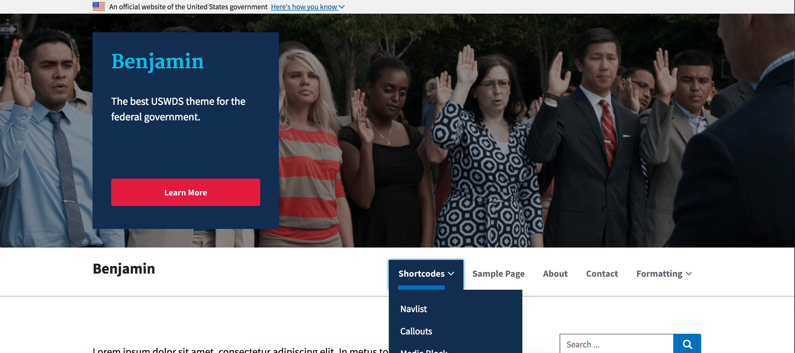

Benjamin
========

Benjamin is a flexible and feature rich WordPess theme build with Automattic's _s (underscores) 
theme 18f's [Web Design Standards](https://standards.usa.gov).  

Be sure to install the companion plugin, [Franklin](https://github.com/kyle-jennings/Franklin/) 
to include various 18F components via shortcodes!
 

## Features

#### Post Format support 
* Video
* Audio
* Image
* Quote
* Status
* Other post formats can be toggled, but there is no special support yet

#### Customizable layout settings:  
* Header background image (select the default image if a "featured image" is not set)
* Header background image positioning
* Header Size (slim, medium, big, and full page)
* Sidebar position (left, right, and none)
* Sidebar size (narrow and wide)
* Sidebar visibility (hide or show on different screen sizes)
* Hide parts of a page (such as the navbar or footer)

#### Template specific layout settings:
* Default settings (the templates below can override the defaults)
* Feeds (archive, search, categories ect)
* Frontpage - a flexible page with sortable rows of widget areas
* Single Posts
* Single Pages
* Widgetized Page - a flexible page template with sortable rows of widget areas
* SideNav Page - a page template which automagically looks for ID'd anchor tags
    and displays a sticky sidenav linking to said tags
* 404 page
* 4 extra page templates
* Custom post type single pages, and feeds
* Each of these templates has it's own specific widget area (only used when override the default settings)

#### Sortable Pages
Some templates have sortable content area - 3 rows  widgetized areas and a row for the page content.

 

#### Feed Featured Posts
* a post can be marked as "featured" and displayed promptly in the feed page hero.  
This replaces the "sticky" feature and works on all custom post types

#### 2 Color schemes

 

#### Header Settings
* Change the order of the site banner (collaspsible widget area), the Hero, and the navbar.
* Change the navbar size (slim and standard padding, it makes a difference when changing the order)
* Display search in the navbar
* Use a brand image for your site title
* Make the navbar stick to the top of the page
* A dark navbar color scheme

#### Header content customizer
* the 404 page and the frontpage have customizable header content

 

#### Footer Settings
* The footer is made up of optional, sortable components like:
* return to top link
* footer menu area
* and 2 widget areas

## 3rd party plugin support
### Contact Form 7 checkbox/radio, and form validation support
### Custom post type support
### Co-authors Plus support

## Shortcodes and Components
These shortcodes are NOT included in the theme by default, but are available in the companion plugin, [Franklin](https://github.com/kyle-jennings/Franklin).

Here are a list of the currently available shortcodes in [Franklin](https://github.com/kyle-jennings/Franklin):
* Labels
* Buttons
* Alerts
* Accordions
* Accordion Groups
* Contact Block
* Brand
* Media Block
* Callout
* Navlist
